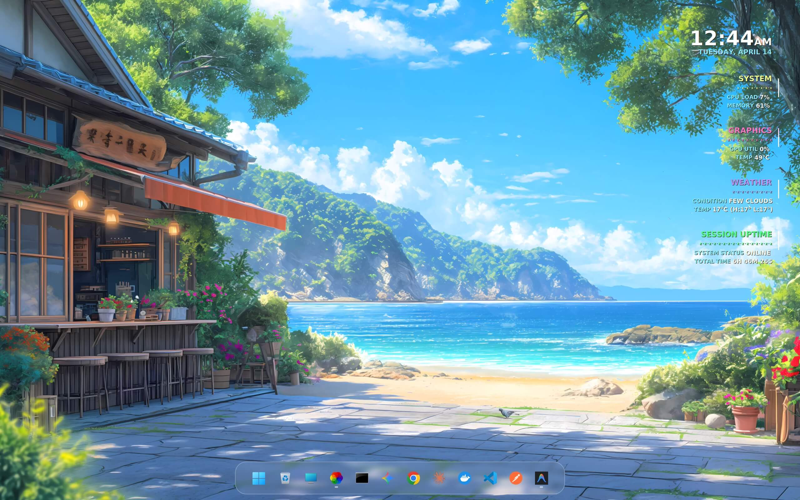
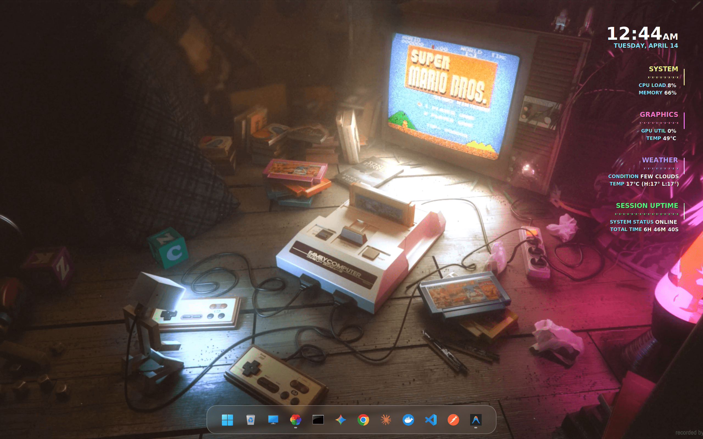

# Flux Pro Conky Theme

A minimalist, timeline-based dashboard optimized for **WSLg** (Windows 11) and modern Linux desktop environments. Flux Pro features a sleek, high-precision aesthetic with vibrant pastel accents and a dual-font typography system.

## 🖼️ Previews

Here is how Flux Pro looks across various aesthetic setups:

### Setup 1: Picturesque Landscape


### Setup 2: Retro Gaming


### Setup 3: Pixel Art Nature

## ✨ Features
- **Dynamic Timeline**: A unique vertical dot-and-bar design tracking your system history.
- **Glassmorphic Elements**: Subtle transparency and vibrant pastel graphics.
- **Dual-Font Precision**: 
  - **Outfit**: Stylish, geometric headers and separators.
  - **Inter**: High-visibility data and content.
- **Real-time Weather**: Integrated OpenWeatherMap fetcher.
- **Hardware Stats**: CPU load, RAM usage, and NVIDIA GPU performance tracking.

## 🛠️ Prerequisites
Before installation, ensure you have the following installed:
- **Conky** (v1.10+ recommended)
- **NVIDIA Drivers** (if using GPU monitoring)
- **Python 3** (for weather data parsing)
- **curl** (for API requests)
- **Fonts**:
  - `Outfit` (Bold/Black)
  - `Inter` (Bold/SemiBold)
  - `Dosis` (Used for specific timeline symbols)

## 🚀 Installation

1. **Clone the repository**:
   ```bash
   git clone https://github.com/your-username/FluxPro.git
   cd FluxPro
   ```

2. **Install Fonts**:
   Copy the contents of `Flux/fonts/` to your system font directory (e.g., `~/.local/share/fonts` or `~/.fonts`) and update the cache:
   ```bash
   mkdir -p ~/.local/share/fonts
   cp -r Flux/fonts/* ~/.local/share/fonts/
   fc-cache -fv
   ```

3. **Configure Weather**:
   - Open `Flux/scripts/weather.sh`.
   - Replace the `api_key` with your [OpenWeatherMap API Key](https://openweathermap.org/api).
   - Change `city_query` to your location (e.g., `"London,gb"`).

4. **Launch the Theme**:
   ```bash
   bash Flux/start_flux.sh
   ```

## ⚙️ Start Automatically on Boot (Windows / WSL2)

To automatically launch Flux Pro silently every time you turn on your PC without needing to open a terminal window, follow these steps:

1. Press `Win + R`, type `shell:startup`, and hit Enter to open your Windows Startup folder.
2. Inside that folder, right-click empty space -> **New** -> **Text Document**. 
3. Name it `StartFluxPro.vbs` (Ensure the extension is `.vbs`, not `.txt`).
4. Right-click the file, select **Edit**, and paste the following code:
   ```vbscript
   Set objShell = WScript.CreateObject("WScript.Shell")
   ' If you cloned FluxPro into a different folder, update the cd path below!
   objShell.Run "wsl.exe bash -c ""cd ~/projects/FluxPro && bash Flux/start_flux.sh""", 0, False
   ```
5. Save and close. The next time Windows boots, Flux Pro will start automatically!

## 🖥️ Compatibility Notes (WSLg vs Linux Native)
This theme is specifically tuned for **WSLg** on Windows 11, which uses a root-less X11 server.
- **WSL Users**: The theme uses `powershell.exe` for robust network fetching and system state checks.
- **Native Linux Users**: You may need to modify the monitoring commands in `Flux.conf` (e.g., replacing `powershell.exe` memory checks with the standard `cpu` and `mem` Conky variables).

## 📄 License
This project is licensed under the **MIT License** - see the [LICENSE](LICENSE) file for details.

---
*Created with ❤️ by Anish*
